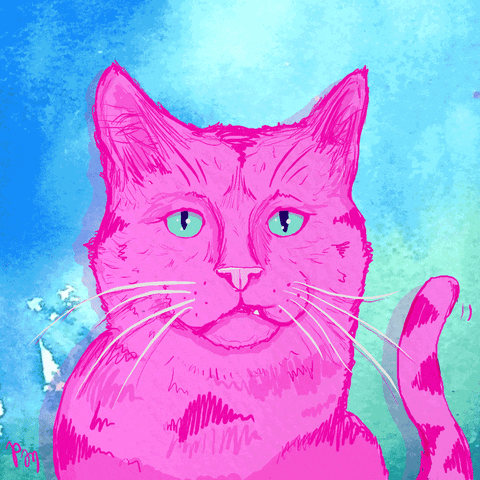
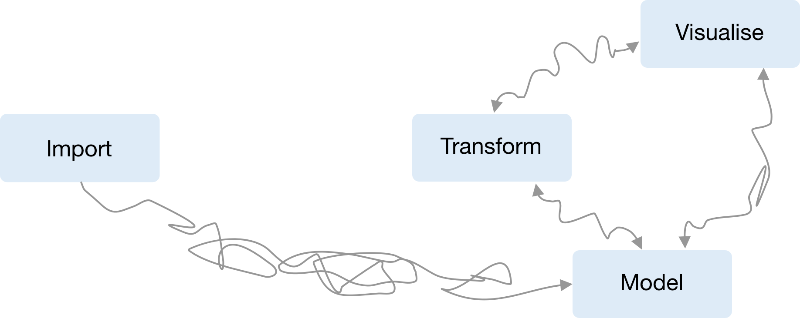
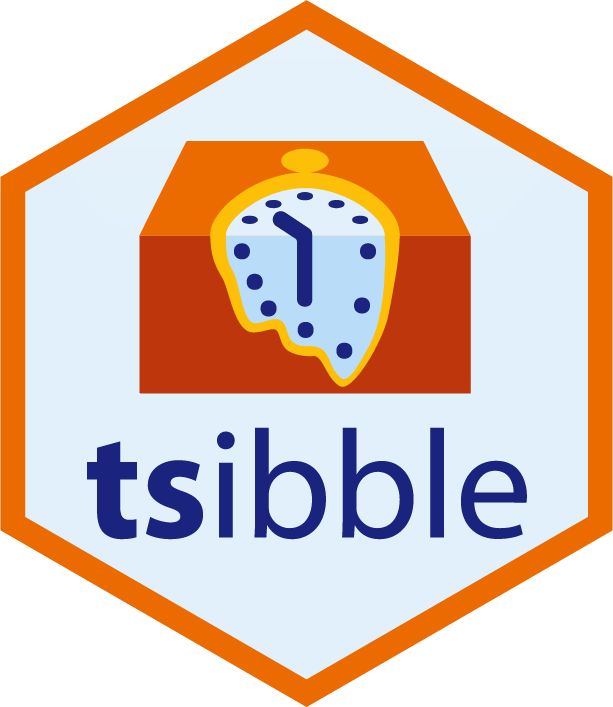
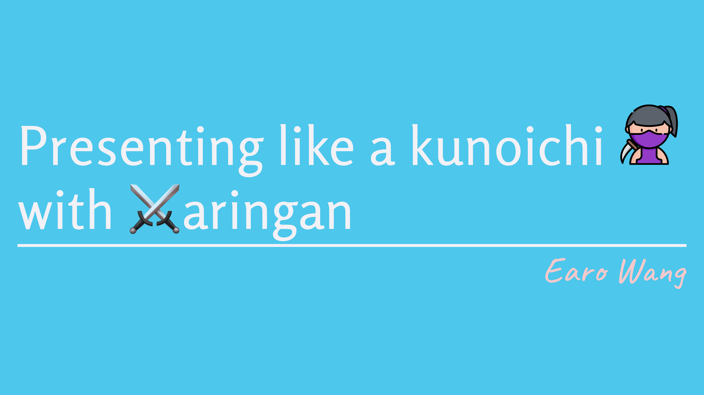
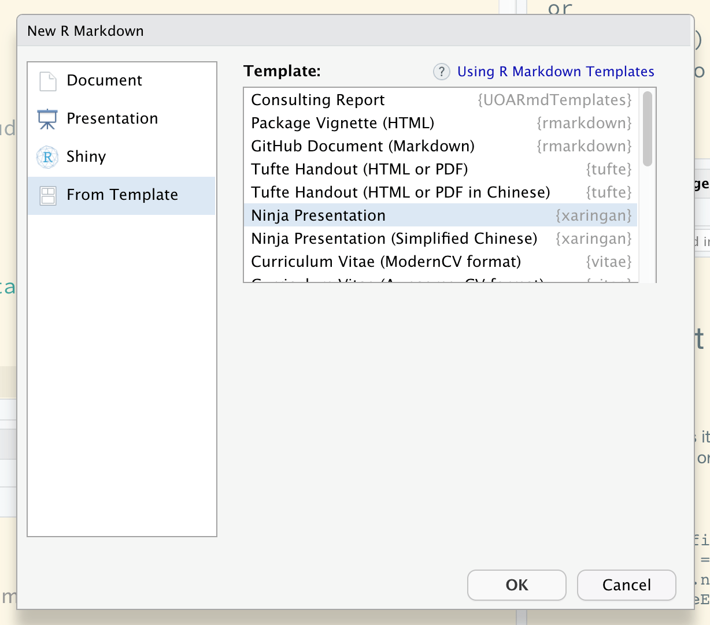
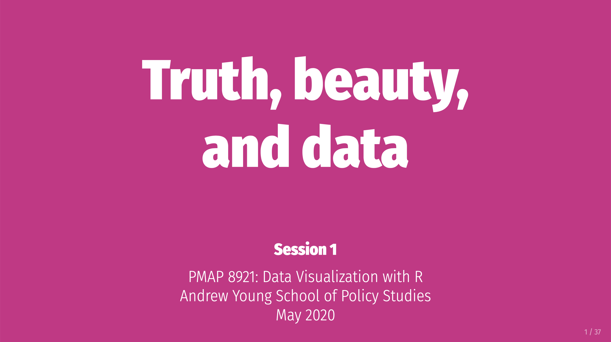

class: middle

```{r setup, echo = FALSE, cache = FALSE, results = 'hide'}
library(knitr)
options(
  htmltools.dir.version = FALSE, tibble.width = 60, tibble.print_min = 6,
  crayon.enabled = TRUE
)
opts_chunk$set(
  echo = FALSE, warning = FALSE, message = FALSE, comment = "#>",
  fig.path = 'figure/', fig.align = 'center', fig.height = 8.5,
  out.width = '100%', fig.show = 'hold', fig.retina = 3,
  cache = TRUE, cache.path = 'cache/'
)
```

.pull-left[
```{r hello}
cowsay::say("Kia Ora! I'm Earo.", by = "anxiouscat")
```
]

--

.pull-right[
<br>
<br>
<br>
I'm a ~~lecturer~~ zoomer.

<i class="fab fa-r-project"></i> package developer

.typed[]
]

???

* Kia ora koutou.
* Most of us will feel nervous when start presenting, like this anxious cat. But will calm down
* Joined as a lecturer, turned out a zoomer, lecturer in pyjamas
* The only thing I managed to upskill is zoom in the past 6 months.
* At Uni, I teach data science, do research on data str, data wrangling, data vis
* I make my research methods available in the form of R packages, developed a bunch of R packages.

---

## My PhD timeline


???

* Completed my PhD at Monash U
* This beeswarm plot: gh commits
* As a PhD student, my academic activities are roughly grouped into 3 cat: writing, coding, and presenting
* 3 chapters, 3 packages, presenting those packages for ts.
* In the past 3 years, I've given 15 talks, formal or informal. Academic seminars, conferences, meetups, workshops.
* I started trying out html5 slides when I started PhD in 2016. I finally settled with xaringan when it was first out in 2016 Dec.
* Interestingly, the first public talk I gave using xaringan, at the wombat conference. Yihui was sitting there. He was invited for the keynote.

---

class: inverse middle center

.pull-left[
<br>
# Opinionated kunoichi
<hr>
# Non-opinionated xaringan
]
.pull-right[


]

???

* divided into 2 parts
* first: how to be a kunoichi presenter, which is quite opinionated
* Bc I'm going to share what I've learnt while presenting. No hard rules about presenting
* Grad schools deliver workshops on presentation tips, 
* We learn presenting by presenting
* And the second part is not opinionated. It's about xaringan.

---

class: inverse middle center

.pull-left[
.animate__animated.animate__bounceInDown[

]
]
.pull-right[
<br>
<br>
# HTML.orange[<i class="fab fa-html5"></i>]
<hr>
# Creative
# Unconventional
]

???

* Kunoichi is a Japanese word for female ninja, an unconventional presenter
* We can creatively use our tones, gestures, facial expressions, but mostly visuals on the slides to express our thoughts.
* To design those visuals, we need to choose tools, and tools shouldn't be a constraint, when we want to be creative and expressive.
* Using latex beamer, I can't embed youtube videos, interactive graphics.
* But HTML5 slides leverages the whole web technology, and allow me to produce creative visuals when needed.

## Creative formats

* Lightning talk vs TikTok
* 20 minutes talk vs Youtube
* 1 hour talk vs Documentary

## Onsite vs remote presentations

* Laugh alone (no passive laugh)
* Presentation vs conversation tone
* Not sure when to pause

---

## .right[`r emo::ji("hammer_and_wrench")` Crafting]

<br>
.alert[
.large[
1. Opening slide
2. Motivating slide
3. Closing slide
]
]

???

* No matter what type of talk we give, (lightning) we'll have these 3 slides:
* We do want to craft them well. Bc they are on the screen much longer than the rest of the slides.
* I'll use my own slides as case studies.

---

.pull-left[
<br>
## .center[Designing title slide]

1. Bigger than big font size
2. Background image
3. Google fonts
4. Handles
5. URLs
]
.pull-right[


]

???

* Title slide stays longer on the screen, bc you set up the computer
* In short talks, you introduce yourself in the beginning without an extra intro slide. 
* font: cliche
* image: evocative. I don't do it, lazy, rearrange the text positions.
* Occasionally, I chose evocative fonts. Another good thing about H5 slides is we can use google fonts on the fly.
* FA icon, but now have no idea why I chose a Halloween colour theme for a conference held in Jan.
* wondering if I presented tidy ts, or spooky ts
* handles: live tweeting
* URLs (I don't share my slides url upfront anymore, to focus on my talk atm)
* But venue is big, screen is small, URLs first

---

class: inverse middle

# Motivating ???? .blue[`beta`]
<hr>
## `r emo::ji("woman_facepalming")`

???

* A critical lesson I learnt from my past talks is motivation matters.
* Motivating well will help set the tone for a successful talk. Bc motivation slides come after the title.
* To accumulate audience's interest and grab their attention, the first 5 minutes is the key.
* I'll give you a facepalming version of how I motivated the tsibble package

---

class: center middle

background-image: url(img/tsibble-useR.png)
background-size: cover

--



???

* I gave my first tsibble talk for an internal department talk. This is the motivation page of tsibble in the early stage.
* The targeted audience is my PhD committee, a small group of faculties and PhD students.
* I thought I was telling my committee. Look I'm not talking about software, I'm talking about matrix. I'm doing serious research.
* The problem is I repeated this slide at useR! and NYC R meetups. Diverse backgrounds
* This slide is made for insiders who know ts in R well, and a narrow focus.
* As you could imagine, half of my audience would lost the interests after this slide.

---

class: inverse middle

## Motivating well .blue[`v1.0.0`]
<hr>
## `r emo::ji("dancer")`

???

* Redesign
* Helped me to position the tsibble and write the tsibble paper

---

.left-column[
<br>
<br>
## .center[.red[time series verse]]
]
.right-column[
<br>
<br>

]

### .center[WAT!`r emo::ji("scream")`]

???

Include audience who are not just insiders, but also data scientists in general.

---

background-image: url(img/tsibble-model.png)
background-size: 70%
background-position: 91% 38%

.left-column[
<br>
<br>
<br>
<br>
## .center[tidyver.red[ts]]
]
.right-column[
.animate__animated.animate__rollIn.animate__slower[
.pipeline[]
]
]

???

* The focus of the tsibble is a workflow facilitator, not a matrix vs a data frame.
* A big picture
* Attract users who don't play with time series data.
* A mixed group, go for breath over depth.

---

class: center middle inverse

# Thank you!

--

# Questions?

--

# Fin

---

class: center middle inverse

.animate__animated.animate__hinge[
# Thank you!
# Questions?
# Fin
]

???

* One slide is wasted.
* This slide is the background when you answering questions.
* But almost zero information.

---

## .center[`r emo::ji("camera_flash")` Closing slide with `r emo::ji("link")``r emo::ji("link")``r emo::ji("link")`]

.pull-left[
<br>
.center[.card[

.small[[slides.earo.me/rladiesakl20](https://slides.earo.me/rladiesakl20)]
]
]
]
.pull-right[
<br>
`r emo::ji("memo")` [Carpe Talk](https://www.tidyverse.org/blog/2018/07/carpe-talk/) by Jenny Bryan and Mara Averick
<hr>
`r emo::ji("memo")` [Guidelines I follow when giving talks](https://www.amelia.mn/blog/misc/2020/04/16/presentations.html) by Amelia McNamara
<hr>
`r emo::ji("memo")` [How to Present Good](http://www.rebeccabarter.com/blog/2017-02-02-how-to-present-good/) by Rebecca Barter
]

???

* Ending talks with resources, I'll say "Thank you"
* If useful and helpful, they take out their phones and fire up the cameras. They will do their homeworks
* 3 blog posts and 4 great presenters in the R community.
* Bc slides are in html, you probably would like a short URL to link to the slides.

---

class: inverse middle

.right[
# Presenting is fun
# `r emo::ji("crossed_swords")`aringan is .purple[creative fun]
]

--

.large[
.blue[1.] Jot down in <i class="fab fa-markdown"></i>

.blue[2.] Prettify with <i class="fab fa-css3-alt"></i>

.blue[3.] Interact with <i class="fab fa-js"></i>
]

???

* Presenting is fun, and xaringan adds more creative fun on top it.
* I hope I accumulate your interests for xaringan, time to talk about it.
* You might think, xaringan is cool and fancy
* The most appealing reason to use xaringan for me is it naturally fits into presentation workflow.

1. pour down all your thoughts and ideas in markdown
2. style them with css
3. for more engaging slides, add js

Unlike other h5 slides, e.g slidyfy, it's highly customisable.

---

## Learn? Unbox and use!

.pull-left[
```r
install.packages("xaringan")
```
.center[]
]
.pull-right[
```yml
---
title: "Presentation Ninja"
subtitle: "⚔<br/>with xaringan"
author: "Yihui Xie"
institute: "RStudio, PBC"
date: "2016/12/12 (updated: `r Sys.Date()`)"
output:
* xaringan::moon_reader:
    lib_dir: libs
    nature:
      highlightStyle: github
      highlightLines: true
      countIncrementalSlides: false
---
```
]

???

* We don't learn markdown. Similarly, we don't learn xaringan.

* It generates an example document for you
* Like other RMarkdown documents
* Click "knit" button, you'll get this slide

---

.center[
`r emo::ji("point_down")` (nested) slides
<iframe src="https://slides.yihui.org/xaringan/" frameborder="0" height="480" width="640">
</iframe>
]

.footnote[`<iframe>` to embed [slides.yihui.org/xaringan](https://slides.yihui.org/xaringan/) within the current document]

???

* It's not a static image. It's official xaringan slides nested within my slides.
* p3: pronouciation
* It documents detailed usage, check it out after this talk.

---

class: inverse right middle

# Chap. <i class="fab fa-markdown"></i>

???

I'll continue with my cookbook. The first chapter: md

---

class: middle

.left-column[
.center[]
### - markdown
]
.right-column[
````markdown
---
background-image: url(img/kunoichi.svg)
background-position: 50% 50%
background-size: cover
class: inverse middle

## Presenting like a kunoichi with `r emo::ji("crossed_swords")`aringan

1. Jot down in Markdown
2. Prettify with CSS
3. Interact with JS

`r ''````{r eval = FALSE}
install.packages("xaringan") #<<
```

.footnote[image credit: Emi Tanaka]
---

````
]

---

background-image: url(img/kunoichi.svg)
background-position: 50% 50%
background-size: cover
class: inverse middle

## Presenting like a kunoichi with `r emo::ji("crossed_swords")`aringan

1. Jot down in Markdown
2. Prettify with CSS
3. Interact with JS

```{r eval = FALSE, echo = TRUE}
install.packages("xaringan") #<<
```

.footnote[image credit: Emi Tanaka]

---

class: inverse right middle

# Chap. <i class="fab fa-css3-alt"></i>

???

Next chapter is styling your slides with css.

---

.left-column[
.center[]
### - markdown
### - prettify
]
.right-column[
## built-in themes
```{r comment = ""}
names(xaringan:::list_css())
```

```yaml
output:
  xaringan::moon_reader:
*   css: [default, rladies, rladies-fonts]
```
]

???

* Don't have time to write your own CSS?
* The default theme is not bad, but get boring quickly when you see the same style everywhere.
* It bundles many user-contributed themes.

---

.left-column[
.center[]
### - markdown
### - prettify
]
.right-column[
## `r emo::ji("art")` xaringanthemer
```yaml
output:
  xaringan::moon_reader:
*   css: xaringan-themer.css
```


]

???

Not a cup of tea?

---

.left-column[
.center[]
### - markdown
### - prettify
]
.right-column[
## <i class="fab fa-github"></i> [emitanaka/ninja-theme](https://github.com/emitanaka/ninja-theme)

]

---

.left-column[
.center[]
### - markdown
### - prettify
]
.right-column[
## Ultimate `custom.css`
```css
@import url('https://fonts.googleapis.com/css2?family=Libre+Barcode+128+Text&display=swap');
.encoding {
  font-family: 'Libre Barcode 128 Text', cursive;
}
```

.pull-left[
```yml
---
output:
  xaringan::moon_reader:
    css: [default, custom.css]
---
.encoding[
This message is encoded.
]
```
]

.pull-right[
```html
<div class="encoding">
  <p>This message is encoded.</p>
</div>
```
.alert.center[.encoding[
This message is encoded.
]]
]
]

???

* Believe it or not, the ultimate theme is creating your own theme.
* As you progress towards kunoichi, no theme will express yourself properly until your theme comes out.

---

class: inverse right middle

# Chap. <i class="fab fa-js"></i>

???

* Stylish-looking slides are not enough?
* Engaging with JS
* An excellent educational tool
* If you teach with R, xaringan for teaching slides

---

.left-column[
.center[]
### - markdown
### - prettify
### - interact
]
.right-column[
## `r emo::ji("stopwatch")` countdown

````markdown
```{r}`r ''`
# install.packages("countdown")
countdown::countdown(minutes = 0, seconds = 42)
```
````

`r countdown::countdown(minutes = 0, seconds = 42)`

.pull-left[
.center[
.alert[
.purple[
## Keep Calm
## and
## Countdown
## <i class="fas fa-stopwatch-20"></i>
]
]
]
]
.pull-right[
.large[## .center[`r emo::ji("point_down")`]]
]
]


???

* Another package from Garrick
* Your turn in class and workshops
* Works in RMarkdown documents and RStudio viewers
* Anna, is this in your trying-out list now?

---

.left-column[
.center[]
### - markdown
### - prettify
### - interact
]
.right-column[
## `r emo::ji("exploding_head")` xaringanExtra

```{r panelset}
xaringanExtra::use_panelset()
```


````markdown
```{r echo = FALSE}`r ''`
# remotes::install_github("gadenbuie/xaringanExtra")
xaringanExtra::use_panelset()
```
````


````md
.panelset[
  .panel[.panel-name[Code]
  <!-- Code -->
  ]

  .panel[.panel-name[Plot]
  <!-- Plot -->
  ]
]
````
]

???

* Yet another package from Garrick
* Many enhanced and useful features to xaringan
* I like the most is creating panels in a slide

---

.left-column[
.center[]
### - markdown
### - prettify
### - interact
]
.right-column[
.right[
### `r emo::ji("bookmark_tabs")`
]
.panelset[
.panel[.panel-name[Code]

```{r ggplot, fig.show = "hide", echo = TRUE}
library(ggplot2)
ggplot(mpg, aes(displ, hwy, colour = class)) +
  geom_point()
```
]

.panel[.panel-name[Plot]

```{r ref.label = "ggplot", fig.height = 5, out.width = "70%"}
```
]
]
]

---

.left-column[
.center[]
### - markdown
### - prettify
### - interact
]
.right-column[
## Use `custom.js`
<br>
```yml
output:
  xaringan::moon_reader:
*   includes:
*     after_body: "custom.js"
```

.center[.typed-eg[]]

.footnote[Typing is powered by [`typed.js`](http://mattboldt.github.io/typed.js/).]
]

???

Use audio input js to control, so speak "Next page" for next page

---

class: center middle

## xaringan in class

.card[
[](https://wcd.numbat.space/slides/week07-abs-data)
]
.card[
[](https://datavizm20.classes.andrewheiss.com/slides/01-slides.html)
]

---

class: middle center

.pull-left[
]
.pull-right[
# .large[<i class="fab fa-html5"></i> `r emo::ji("heavy_plus_sign")` <i class="fab fa-r-project"></i>]


]

???

## portable || dynamic

---

class: middle

.pull-left[
.center[
.card[

.small[
[slides.earo.me/rladiesakl20](https://slides.earo.me/rladiesakl20)  
]
]

<i class="fab fa-github"></i> [earowang/rladiesakl20](https://github.com/earowang/rladiesakl20)
]
]

.pull-right[
<i class="fas fa-images"></i> [remark.js](https://remarkjs.com)

<i class="fas fa-images"></i> [Presentation ninja](https://slides.yihui.org/xaringan)

<i class="fas fa-images"></i> [Making slides in R Markdown](https://arm.rbind.io/slides/xaringan.html)

<i class="fas fa-book-open"></i> [xaringan wiki](https://github.com/yihui/xaringan/wiki)

<i class="fas fa-blog"></i> [Infinite moon reader](https://yihui.org/en/2019/02/ultimate-inf-mr/)
]
