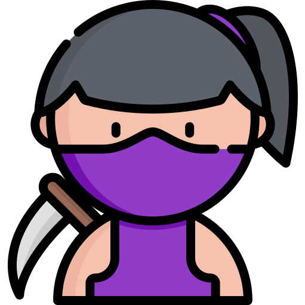

class: middle

```{r setup, echo = FALSE, cache = FALSE, results = 'hide'}
library(knitr)
options(
  htmltools.dir.version = FALSE, tibble.width = 60, tibble.print_min = 6,
  crayon.enabled = TRUE
)
opts_chunk$set(
  echo = FALSE, warning = FALSE, message = FALSE, comment = "#>",
  fig.path = 'figure/', fig.align = 'center', fig.height = 8.5,
  out.width = '100%', fig.show = 'hold', fig.retina = 3,
  cache = TRUE, cache.path = 'cache/'
)
```

.pull-left[
```{r hello}
cowsay::say("Kia Ora! I'm Earo.", by = "anxiouscat")
```
]

--

.pull-right[
I'm a ~~lecturer~~ zoomer.

.large[```r
data[c(
  "instructor",
  "researcher",
  "visualiser" 
)]
```]

.large[.center[<i class="fas fa-arrows-alt-v"></i>]]

.center[<i class="fab fa-r-project"></i> package developer]
]

---

## My PhD timeline


---

class: inverse middle center

.pull-left[
<br>
# Opinionated kunoichi
<hr>
# Non-opinionated xaringan
]
.pull-right[
.animate__animated.animate__bounceInDown[

]
]

---

## Kunoichi presenter

* Unconventional presentation
* Embed personality into presentation
  + font
  + colour theme
* Contrast to novel academic presentation

---

## Creative formats

* Lightning talk vs TikTok
* 20 minutes talk vs Youtube
* 1 hour talk vs Documentary

## Onsite vs remote presentations

* Laugh alone (no passive laugh)
* Presentation vs conversation tone
* Not sure when to pause

---

.pull-left[
<br>
## .center[Designing title slide]

1. Bigger than big font size
2. Background image
3. Google fonts
4. Handles
5. URLs
]
.pull-right[


]

---

class: inverse middle

# Motivating well .blue[`beta`]
<hr>
## `r emo::ji("woman_facepalming")`

---

class: center middle

background-image: url(img/tsibble-useR.png)
background-size: cover

--


---

class: inverse middle

## Motivating well .blue[`v1.0.0`]
<hr>
## `r emo::ji("dancer")`

---

.left-column[
<br>
<br>
## .center[.red[time series verse]]
]
.right-column[
<br>
<br>

]

### .center[WAT!`r emo::ji("scream")`]

---

background-image: url(img/tsibble-model.png)
background-size: 70%
background-position: 91% 38%

.left-column[
<br>
<br>
<br>
<br>
## .center[tidyver.red[ts]]
]
.right-column[
.animate__animated.animate__rollIn.animate__slower[
.pipeline[]
]
]

---

class: center middle inverse

# Thank you!

--

# Questions?

--

# Fin

---

## .center[`r emo::ji("camera_flash")` Closing slide with `r emo::ji("link")``r emo::ji("link")``r emo::ji("link")`]

.pull-left[
<br>
.center[.card[

.small[[slides.earo.me/rladiesakl20](https://slides.earo.me/rladiesakl20)]
]
]
]
.pull-right[
<br>
`r emo::ji("memo")` [Carpe Talk](https://www.tidyverse.org/blog/2018/07/carpe-talk/) by Jenny Bryan and Mara Averick
<hr>
`r emo::ji("memo")` [Guidelines I follow when giving talks](https://www.amelia.mn/blog/misc/2020/04/16/presentations.html) by Amelia McNamara
<hr>
`r emo::ji("memo")` [How to Present Good](http://www.rebeccabarter.com/blog/2017-02-02-how-to-present-good/) by Rebecca Barter
]

---

## `r emo::ji("crossed_swords")`aringan

???

We know how to be a kunoichi, we need tooling

---

## Learn? Unbox and use it!

* Jot down thoughts in markdown
* Prettify it with css
* Interact with JS

---

[slides.earo.me/rladiesakl20](https://slides.earo.me/rladiesakl20)
